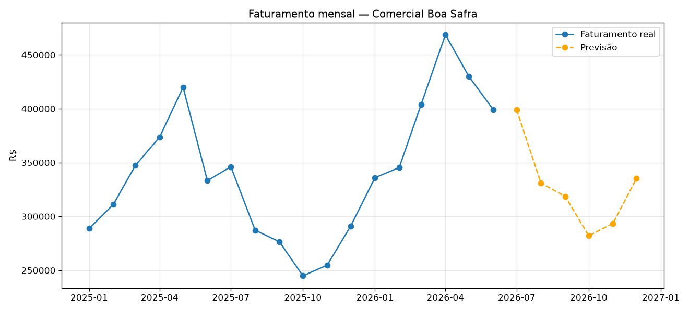
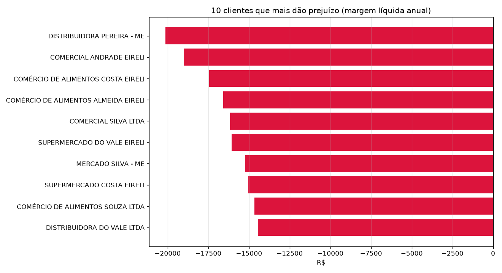

# 📊 Plataforma de Dados — Comercial Boa Safra

> Projeto de **Engenharia de Dados** que unifica quatro sistemas que "não se falam" para
> responder a uma pergunta simples que a empresa não conseguia responder:
> **"Quais clientes realmente dão lucro?"**

*(Caso fictício com dados 100% sintéticos, para fins de estudo e portfólio.)*

---

## 🎯 O problema

A Comercial Boa Safra é uma distribuidora atacadista (R$ 92 mi/ano, ~3.400 clientes,
~6.500 produtos). Ela roda sobre **quatro sistemas que não conversam entre si**, e o
mesmo cliente aparece com uma identidade diferente em cada um:

| Sistema | O que controla | Como identifica o cliente |
|---|---|---|
| ERP (Protheus antigo) | Faturamento, estoque, financeiro | Código `000091` + CNPJ com máscara |
| Força de vendas (app) | Pedidos e visitas de representantes | `MG-1035` + CNPJ só números |
| E-commerce B2B | Pedidos online | E-mail do comprador (sem CNPJ) |
| Planilhas (Compras) | Custo, frete, metas, comissão | Nome digitado à mão |

Resultado: a diretoria "decide no escuro", relatórios levam dias e ninguém sabe quais
clientes dão prejuízo depois de todos os custos. Oportunidade estimada no diagnóstico:
**R$ 800 mil a R$ 1,3 milhão por ano**.

---

## 🏗️ Arquitetura (Bronze → Prata → Ouro)

Os dados passam por três camadas, do bruto ao pronto para decisão:

- **Bronze (`data/raw`)** — dado cru, do jeito que saiu de cada sistema. Nunca é alterado.
- **Prata (`data/interim`)** — dado limpo e padronizado (formatos, encoding, CNPJ, datas).
- **Ouro (`data/processed`)** — fonte única de verdade: vendas unificadas e margem por cliente.

## 🧰 Stack

- **Python** + **pandas** — leitura, limpeza e junção dos dados
- **openpyxl** — leitura de arquivos Excel
- **rapidfuzz** — casamento aproximado de nomes (fuzzy matching)

## 📁 Estrutura do projeto

```
Projeto_Safra_Distribuidora/
├── data/
│   ├── raw/         # Bronze — dados brutos das 4 fontes
│   ├── interim/     # Prata — dados limpos
│   └── processed/   # Ouro — fonte única e margem
├── src/             # Scripts do pipeline
├── notebooks/       # Exploração
├── reports/         # Gráficos e dashboard
└── README.md
```

## ▶️ Como rodar

```bash
python -m venv .venv
.\.venv\Scripts\Activate.ps1        # Windows PowerShell
pip install pandas openpyxl rapidfuzz
python src/02_padronizar_faturamento.py
python src/03_padronizar_clientes.py
python src/04_reconciliar_clientes.py
```

## ✅ Status

- [x] Passo 0 — Ambiente e estrutura do projeto
- [x] Passo 1 — Conhecer as 4 fontes
- [x] Passo 2 — Padronizar (camada prata)
- [x] Passo 3 — Reconciliar clientes (ERP + app + e-commerce numa chave única)
- [x] Passo 4 — Fonte única de vendas + margem por cliente
- [x] Passo 5 — Previsão de vendas
- [x] Passo 6 — Dashboard
- [ ] Passo 7 — Publicação (em andamento)

## 📈 Principais resultados

- **Faturamento real desmascarado:** a soma ingênua dos 3 sistemas dava R$ 11,6 mi, mas o
  faturamento real é **R$ 6,16 mi** — R$ 5,4 mi eram vendas duplicadas (app e e-commerce já
  estão dentro do ERP).
- **20% dos clientes dão prejuízo** (212 de 1.063), drenando **R$ 1,1 mi/ano** — validando a
  suspeita do diagnóstico (15–20%). Principal causa: o **frete** (custo de atendimento).

## 📊 Dashboard

**Faturamento mensal + previsão do 2º semestre de 2026:**



**Os 10 clientes que mais dão prejuízo (margem líquida anual):**



## 🔎 Destaques técnicos

- Reconciliação de identidades: ERP↔app por **CNPJ normalizado** (431/431) e e-commerce por
  **e-mail** (204/204), sempre **validando** cada id contra o cadastro oficial.
- Lição aprendida: **fuzzy matching por nome gera falsos positivos** quando só um número
  distingue os clientes — resolvido usando a chave confiável (e-mail).
- **Análise de sensibilidade** do frete: testei um modelo alternativo, mostrou-se irreal,
  mantive o original e documentei a premissa de maior incerteza.

---

*Autor: Filipe Sousa · Projeto de estudo em Engenharia de Dados*
